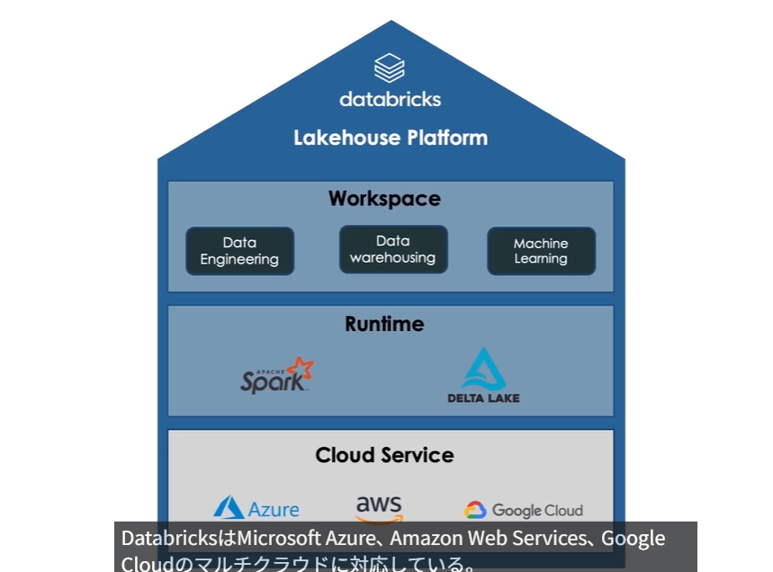

- UnityCatalog - ノートブック - ジョブを組み合わせて処理フローを図示する

# Udemy講座メモ

- データレイクハウス
  - データレイクの特性とデータウェアハウスの特性を併せ持ったアーキテクチャ


- databricksが持っているサーバーにaptch sparkとdelta lakeというruntimeが乗っているイメージ
  - イメージはdelta lakeで複数ソースのCRUDを可能にして、apatch sparkで大量データの加工や分析をするアーキテクチャイメージ
  - このruntimeがcloudインスタンスにのっていて、操作をworkspaceから行う
- apatch spark
  - apatchが管理しているOSS
  - 複数クラスタで高速に計算するための処理エンジン
  - 数PBクラスのデータを数百台のマシンに分散させて高速処理する機能を持つ
  - 他にバッチ処理やリアルタイム処理をしたり、機械学習やグラフ解析をする機能もある
  - databricks自体がSparkを開発したエンジニアによって作られている
- delta lake
  - もともとはdatabricks社が開発しているが、現在はOSSになっている
  - S3やAzureストレージなどのデータレイクの上にかぶせることで、全体を一つのソースとしてRDBのテーブルのように管理できる機能をもつ
  - 複数ソースにたいしてACIDトランザクションやCRUD、変更履歴やバージョン管理ができる
  - データガバナンス制御としてスキーマのチェックなども可能
- Databricksでは構造化/非構造化データのほかに画像や動画も扱える


Databricks（Delta Lake）における **「Delta Lakeの履歴管理（Time Travel）」** と **「メダリオンアーキテクチャ（Bronze / Silver / Gold）」** の役割と設計の考え方をまとめました。

---

## 1. Delta Lake の履歴管理（Time Travel / Versioning）

Delta Lakeは、単一のDeltaテーブルに対するすべての変更操作（`INSERT`, `UPDATE`, `DELETE`, `MERGE` 等）を `_delta_log`（トランザクションログ）に記録し、マルチバージョン並行処理（MVCC）を実現しています。

### 基本概念

* **追加書き込み（Append-only）原則**
データを更新・削除しても既存の Parquet ファイルを直接書き換えず、新しい Parquet ファイルを追加してメタデータで有効/無効を管理します。
* **Time Travel 構文**
過去の特定の時点（`TIMESTAMP AS OF`）や、特定のコミットバージョン（`VERSION AS OF` / `@v36`）を指定してクエリを実行できます。

### 主な用途

* **データパイプラインの再現性（Reproducibility）**
過去の特定時点でのデータ状態を再現し、MLモデルの再学習や過去決算レポートの数値を1円も狂わずに再出力する。
* **障害復旧（Rollback）**
夜間バッチの誤更新やデータ破損が発生した際、更新直前のタイムスタンプにテーブルを即座に書き戻す。
* **差分抽出・デバッグ**
「昨日の時点」と「今日の時点」を比較して変更レコードを抽出したり、データ不整合の発生タイミングを特定する。

### 運用上の制約・注意点

* **保持期間の制限**
タイムトラベルが可能な期間はログおよび旧ファイルの保持期間（デフォルト 7日間など）に限られます。
* **`VACUUM` との関係**
ストレージ節約のために `VACUUM` を実行して不要な過去 Parquet ファイルを物理削除すると、それ以前のタイムスタンプへ遡ることはできなくなります。

---

## 2. メダリオンアーキテクチャ（Bronze / Silver / Gold）

データレイクハウスにおいて、データの品質（Quality）と集約度（Aggregation）を段階的に高めていくデータ層の設計パターンです。

```text
[ 元システム (PostgreSQL / API / Log) ]
                  │
                  ▼ (全件スナップショット / 差分取込)
       【 Bronze Layer (生データ層) 】
                  │  ※ Delta Lake Time Travel 保有
                  ▼ (クレンジング / SCD Type 2 化)
       【 Silver Layer (構造化・履歴管理層) 】
                  │  ※ 高品質なデータ基盤
                  ▼ (ビジネスロジック適用 / 事前集計)
       【 Gold Layer (用途別・集計層) 】
                  │  ※ BI / ダッシュボード / 分析
                  ▼

```

### 各レイヤーの責務と設計パターン

#### ① Bronze（ブロンズ：生データ層）

* **役割**: 元システム（PostgreSQLやS3など）から取り込んだままの未加工データ（Raw Data）をそのまま保持する。
* **処理内容**: データを変更せず、そのまま Append（追加）保存。取り込み日時カラム（`_ingested_at`）などを付与。
* **理由**: 元データの忠実なコピーを保持しておくことで、後続の変換ロジックに変更・バグがあった場合でも何度でも最初からリプレイ（再処理）可能にするため。

#### ② Silver（シルバー：構造化・履歴管理層）

* **役割**: ブロンズ層のデータに対してクレンジング・構造化を行い、**「ビジネスで安心して使える綺麗なデータ」** に仕立て上げる。
* **処理内容**:
* 型変換、NULLの補正、重複除去、フォーマット整形。
* 元システム側で消えてしまう変更履歴を、**SCD Type 2（有効開始日・有効終了日・最新フラグ）** などの形式で長期的なテーブル履歴として再構築（`MERGE INTO` 等の利用）。


* **理由**: 分析・集計の土台となるデータ品質を保証するため。

#### ③ Gold（ゴールド：用途別・集計層）

* **役割**: 特定のビジネス用途、BIダッシュボード、機械学習特徴量向けに集計・加工されたエンドユーザー向けデータ。
* **処理内容**: 事前集計（`GROUP BY`）、KPI算出、ビジネスルールの適用、用途ごとのデータ抽出（例: `WHERE is_current = TRUE` で絞り込んだ最新マスタビュー）。
* **理由**: クエリの応答速度（パフォーマンス）を高め、ビジネスユーザーが直感的に分析できるようにするため。

---

## 3. 「Time Travel」と「メダリオンアーキテクチャ」の使い分け

| 観点 | Delta Lake の Time Travel | メダリオンアーキテクチャ（Silver/Gold） |
| --- | --- | --- |
| **主目的** | **時間軸での状態復元**（何時の状態に戻すか） | **データの品質・構造の最適化**（意味のあるデータへ変換） |
| **データの状態** | 過去時点の「生」または「処理途中のデータ」 | クレンジング・ビジネスルール適用済みのデータ |
| **履歴の持ち方** | `_delta_log` による物理ファイルの自動バージョン管理 | カラム（`valid_from`, `valid_to` 等）による論理的なビジネス履歴 |
| **保持期間** | 短期〜中期（`VACUUM` で消去される運用） | 永続的（ビジネス上の要件期間） |

### まとめ

* **Time Travel** は、システム運用・エラーリカバリ・監査・特定時点の再現のための **インフラ/ストレージ層の機能**。
* **メダリオンアーキテクチャ** は、元システムが洗い替えなどで失ってしまう過去の変更をビジネス価値として活用しやすくするための **データ設計パターン**。

この2つを組み合わせることで、「データパイプラインの堅牢性」と「過去から現在に至るデータ分析の柔軟性」を両立させることができます。