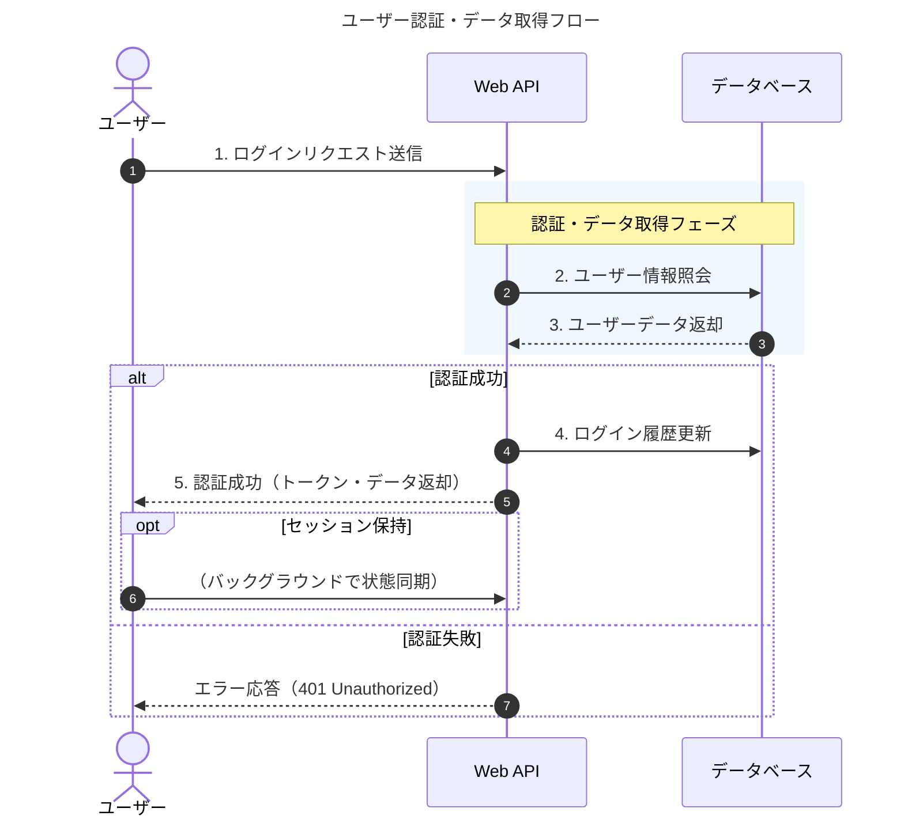
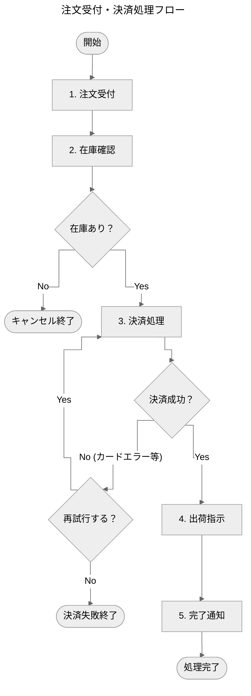
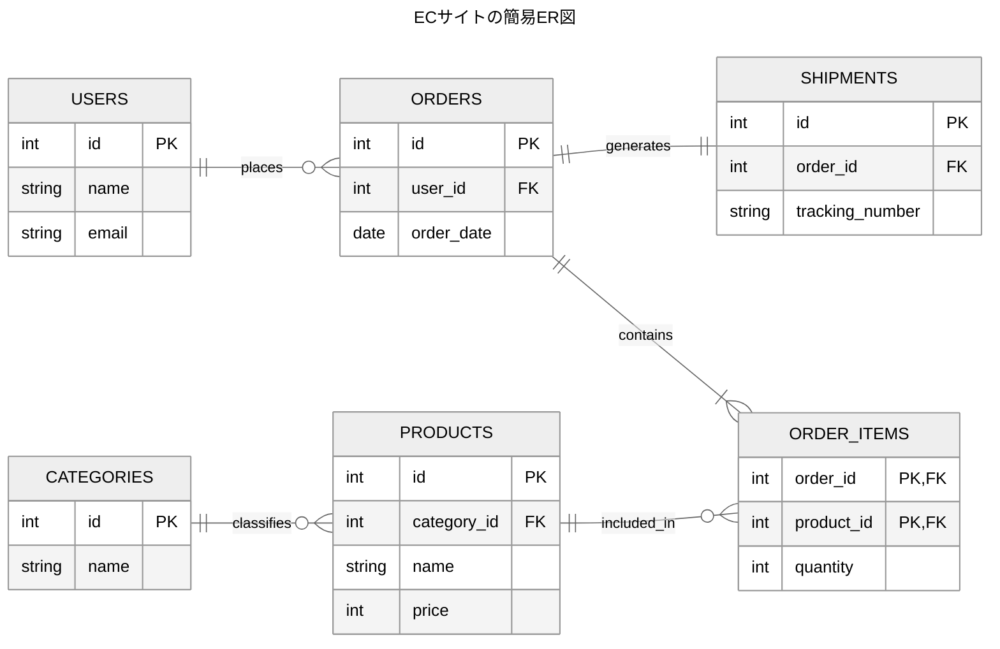

Mermaidでは、フロントマター（`---`で囲まれた領域）や `config:` ディレクティブを使って図全体の設定を指定できます（指定方法はMermaid公式ドキュメントより）。

代表的な設定項目を各図の種類ごとにまとめました。

### 1. 全図共通（共通フロントマター）

すべての図で共通して使える主な設定です。

| 設定項目 | 型 / 値の例 | 概要 |
| :--- | :--- | :--- |
| `title` | 文字列 | 図のタイトル |
| `config.theme` | `'default'`, `'forest'`, `'dark'`, `'neutral'`, `'base'` | 全体のテーマ（見た目） |
| `config.themeVariables` | オブジェクト (例: `{ "primaryColor": "#ff0000" }`) | テーマのカラーなどを個別カスタマイズ |

---

### 2. シーケンス図（Sequence Diagram）

`config.sequence` 配下に指定します。
| 設定項目 | 型 / 値の例 | 概要 |
| :--- | :--- | :--- |
| `config.sequence.showSequenceNumbers` | `true` / `false` | メッセージに連番を表示するか |
| `config.sequence.actorMargin` | 数値 (例: `50`) | アクター間の横の余白（ピクセル） |
| `config.sequence.width` | 数値 (例: `150`) | アクターボックスの幅 |
| `config.sequence.height` | 数値 (例: `65`) | アクターボックスの高さ |
| `config.sequence.boxMargin` | 数値 (例: `10`) | `box`（グループ枠）の余白 |
| `config.sequence.boxTextMargin` | 数値 (例: `5`) | `box` 内テキストの余白 |
| `config.sequence.useMaxWidth` | `true` / `false` | 描画領域の幅いっぱいに自動拡大するか |
| `config.sequence.mirrorActors` | `true` / `false` | 図の下部にもアクター（参加者）を表示するか |
| `config.sequence.noteAlign` | `'left'`, `'center'`, `'right'` | Note（注釈）内のテキストの配置方向 |
| `config.sequence.wrap` | `true` / `false` | メッセージやNote内の長文テキストを自動折り返しするか |
| `config.sequence.rightAngles` | `true` / `false` | 矢印の線を曲線ではなく直角（カクカク）にするか |
| `config.sequence.messageMargin` | 数値 (例: `45`) | メッセージ（矢印）間の垂直方向の間隔（ピクセル） |

**記述例:**

---

---

### 3. フローチャート

| 設定項目 | 型 / デフォルト値 | 概要・値の例 |
| :--- | :--- | :--- |
| `config.flowchart.curve` | 文字列 (`'basis'`) | 接続線の形状（`'basis'`, `'linear'`, `'cardinal'`, `'step'` 等） |
| `config.flowchart.nodeSpacing` | 数値 (`50`) | 隣り合うノード同士の横（または縦）の間隔（ピクセル） |
| `config.flowchart.rankSpacing` | 数値 (`50`) | 階層（ランク）間の垂直（または水平）方向の間隔（ピクセル） |
| `config.flowchart.padding` | 数値 (`15`) | ノード内部のテキストと枠線との余白（ピクセル） |
| `config.flowchart.htmlLabels` | ブール値 (`true`) | ラベル内での HTML タグ（` ` や `<b>` 等）の使用可否 |
| `config.flowchart.useMaxWidth` | ブール値 (`true`) | 描画領域（親要素）の横幅に合わせて自動的に拡大・縮小するか |
| `config.flowchart.defaultRenderer` | 文字列 (`'dagre-wrapper'`) | 描画エンジン指定（`'dagre-wrapper'`, `'elk'` 等） |
| `config.flowchart.subGraphTitleMargin.top` | 数値 (`0`) | サブグラフ（グループ枠）のタイトル上部の余白（ピクセル） |
| `config.flowchart.subGraphTitleMargin.bottom` | 数値 (`0`) | サブグラフ（グループ枠）のタイトル下部の余白（ピクセル） |
| `config.flowchart.wrappingWidth` | 数値 (`200`) | ノード内テキストを自動折返しする際の幅（ピクセル） |
| `config.flowchart.diagramPadding` | 数値 (`8`) | フローチャート全体の外周余白（ピクセル） |

**記述例**

---

---

### 4. ER図

| 設定項目 | 型 / デフォルト値 | 概要・値の例 |
| :--- | :--- | :--- |
| `config.er.minEntityWidth` | 数値 (`100`) | エンティティ（テーブル）ボックスの最小幅（ピクセル） |
| `config.er.minEntityHeight` | 数値 (`75`) | エンティティ（テーブル）ボックスの最小高さ（ピクセル） |
| `config.er.entityPadding` | 数値 (`15`) | ボックス内部のテキストと枠線との余白（ピクセル） |
| `config.er.stroke` | 色コード (`'gray'`) | エンティティ枠線およびリレーション線の描画色（例: `'#333333'`） |
| `config.er.fill` | 色コード (`'#f9f9f9'`) | エンティティボックスの背景色（例: `'#ffffff'`） |
| `config.er.fontSize` | 数値 (`12`) | テキストのフォントサイズ（ピクセル） |
| `config.er.useMaxWidth` | ブール値 (`true`) | 描画領域（親要素）の横幅に合わせて自動的に拡大・縮小するか |
| `config.er.fontFamily` | 文字列 (`'trebuchet ms'`) | ER図全体で使用するフォント（例: `'sans-serif'`, `'monospace'`） |
| `config.er.diagramPadding` | 数値 (`20`) | ER図全体の外周余白（ピクセル） |
| `config.er.renderMode` | 文字列 (`'default'`) | 描画モード（`'default'`、または一部要素を簡略化する `'compact'` 等） |

**記述例**

---

---