# MuleSoft for Flow : IDP
## 参考資料

- [デモ動画](https://videos.mulesoft.com/watch/PtGxds2xs4DjVHUKY1fGpo)
- [ハンズオン資料](https://jpn-codelabs.pub.codelabs.tools.mulesoft.com/codelabs/a0AKY000000A9k42AC/index.html#0)（実際に実行するには専用のライセンスが必要）

## IDPの基本機能

- Salesforce core上で動くIDP
  - 名前にMuleSoftが入っているのは、どうやらMuleSoft IDPをSalesforce向けにカスタムしたものだからぽい
- 基本的にSalesforceにアップロードされたファイルからデータを抽出する
- あらかじめ読み取り項目と項目ごとのプロンプトを定義しておき、定義した内容をフロービルダーから呼び出すことが基本
- 読み取り精度が低い場合はIDP側でフローを中断しhuman in the loopを実行することが可能

## ユースケース

(1) 標準のファイル機能にファイルアップロード後、レコードトリガーで起動してファイル内容からレコード作成

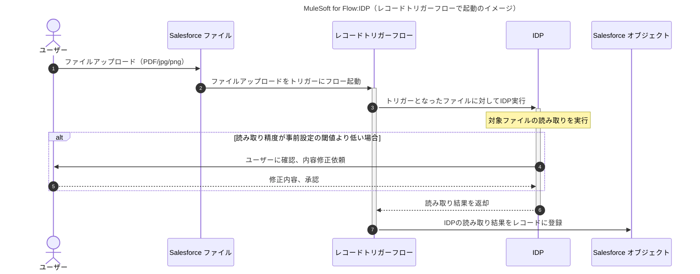

(2) 画面フローからファイルをアップロードして、レコードを作成するイメージ

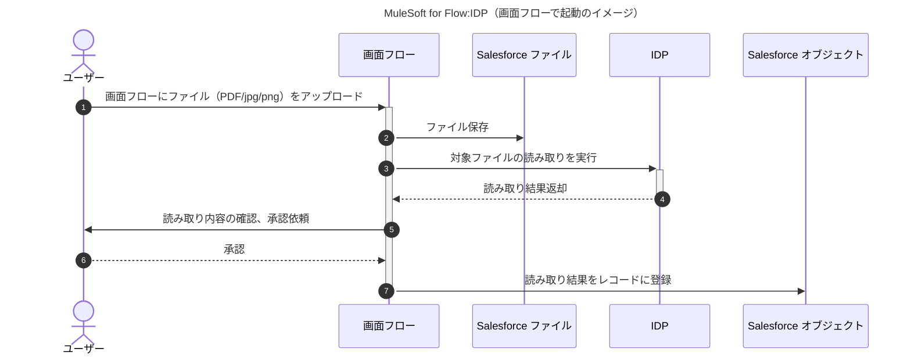

## 参考：レコードトリガーフローと画面フローの構築

次の2つのフローを作成する手順を記載する。

1. 発注書ファイルアップロードをトリガーに発注書に紐づく受注レコードを作成するレコードトリガーフロー ※
2. 受注レコードに紐づく発注書のプレビューを表示する画面フロー

※ IDPは利用できないので作成するレコードは紐づくファイル以外は固定値

### 事前準備

標準オブジェクトは項目が多く手間がかかるので、簡単なカスタムオブジェクト：受注明細を作成する。
設定する項目は

- 受注明細名
- 連番（今回サンプル作成のため連番を付与）
- 発注書ID（ContentDocumentを直接参照できないのでIDをテキストで保持）

の3項目とする

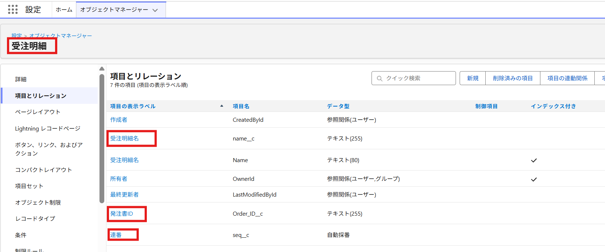

また作成されるレコードを確認するためにカスタムタブを作成しておく。

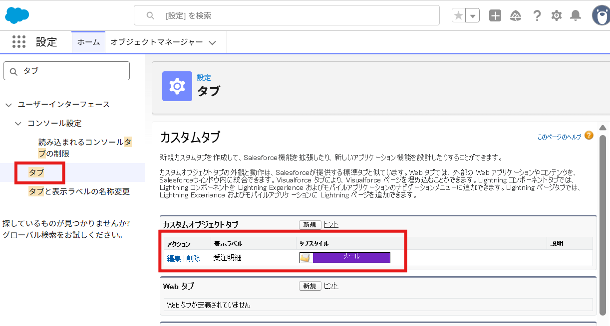

### レコードトリガーフローの構築

- レコードトリガーフローを作成し、トリガーとなるオブジェクトは`ContentDocument`を選択
- 必要に応じて起動条件を追加（今回はファイル名に発注書が含まれる場合に起動）

.png)

- レコード作成処理を追加して受注明細レコードを作成する
- 発注書IDには`{!$Record.Id}`を指定（トリガーになるファイルのsf_id）

.png)

- 保存、有効化をして完了

### 実際に動かす

- ファイルタブから`発注書`を含むファイルをアップロード

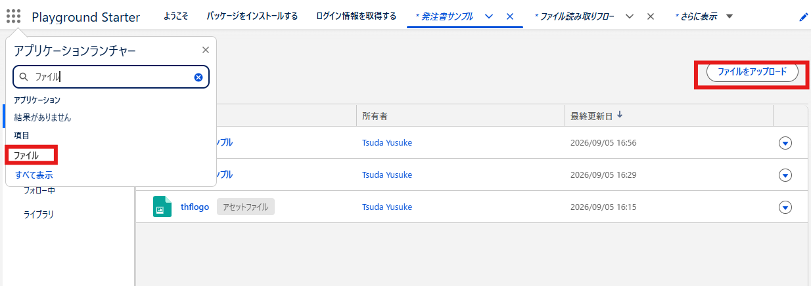

- 実際に対象のファイルと紐づくレコードが作成されていることを確認

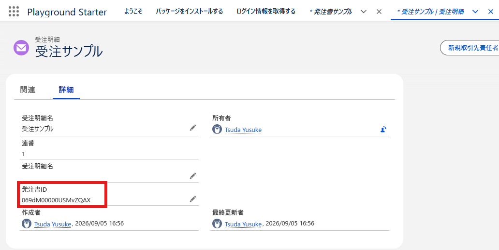

## 画面フローの構築

ファイルプレビューには[ファイルプレビュー画面コンポーネント](https://help.salesforce.com/s/articleView?id=platform.flow_ref_elements_screencmp_file_preview.htm&type=5)を利用する。

### 画面フローの構築

- 画面フローを新規作成し、ツールボックスから変数`recordId`を追加

※ `recordId`については[こちら](https://go.dx.business/dev/salesforce/24561)を参考

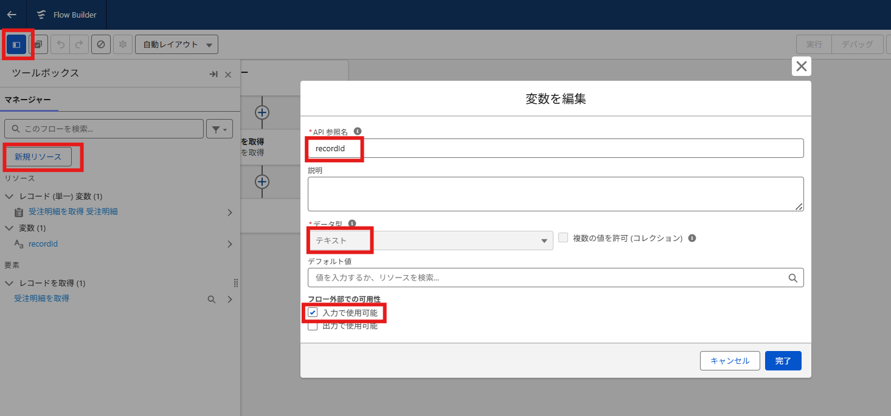

- 表示対象の受注レコードを取得する

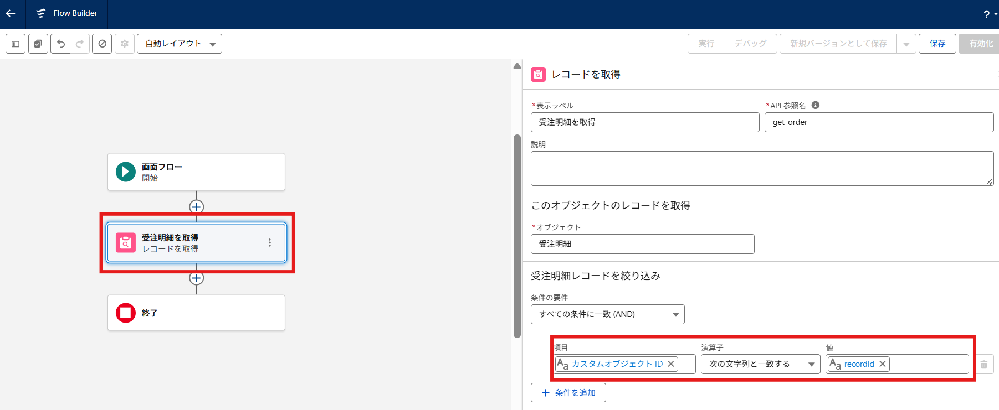

- 画面要素を追加し、file previewを選択
- 表示ラベルは`発注書`とする

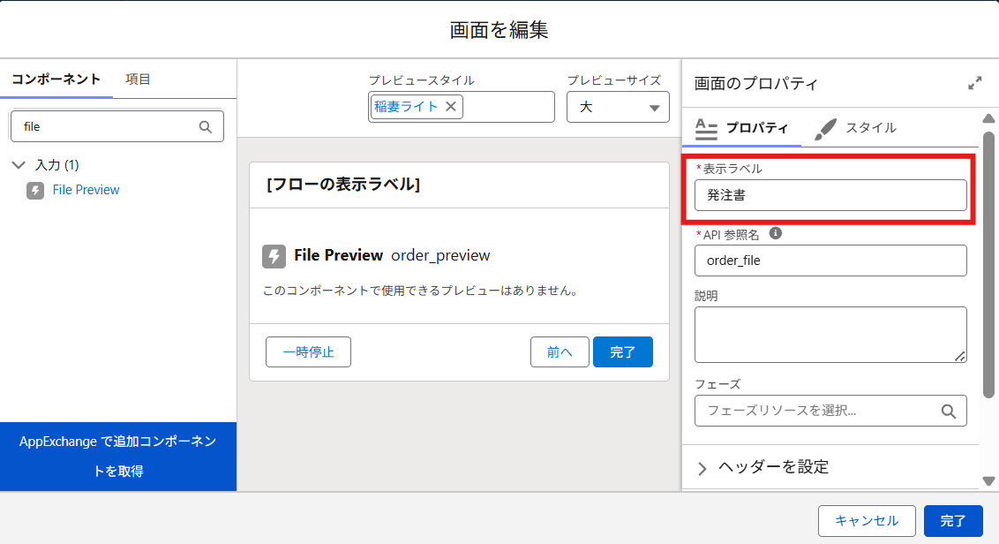

- Content Document IDに`{!get_order.Order_ID__c}`を設定する

.png)

- 保存して有効化する

### Lightning レコードページへの追加

- 受注明細のLightningレコードページ設定にて画面フローを追加する

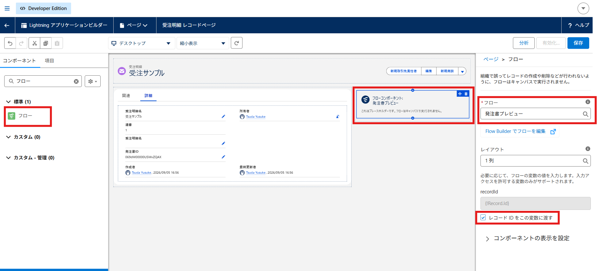

- レコードページに戻ってプレビューが表示されることを確認

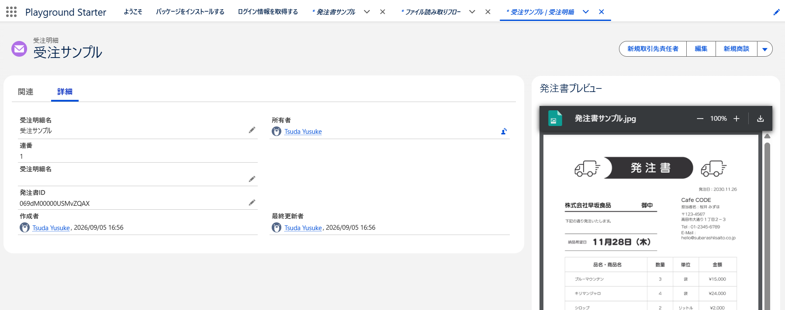