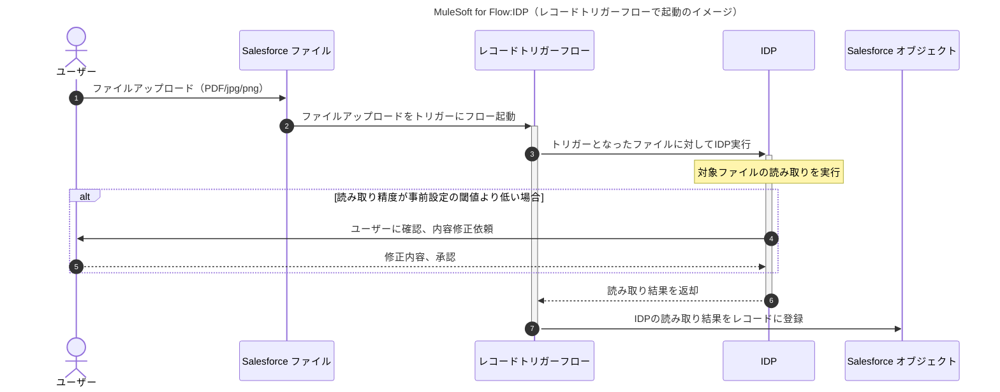
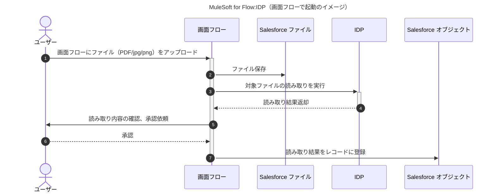

# MuleSoft for Flow : IDP
## 参考資料

- [デモ動画](https://videos.mulesoft.com/watch/PtGxds2xs4DjVHUKY1fGpo)
- [ハンズオン資料](https://jpn-codelabs.pub.codelabs.tools.mulesoft.com/codelabs/a0AKY000000A9k42AC/index.html#0)（実際に実行するには専用のライセンスが必要）

## IDPの基本機能

- Salesforce core上で動くIDP
  - 名前にMuleSoftが入っているのは、どうやらMuleSoft IDPをSalesforce向けにカスタムしたものだからぽい
- 基本的にSalesforceにアップロードされたファイルからデータを抽出する
- あらかじめ読み取り項目と項目ごとのプロンプトを定義しておき、定義した内容をフロービルダーから呼び出すことが基本
- 読み取り精度が低い場合はIDP側でフローを中断しhuman in the loopを実行することが可能

## ユースケース

(1) 標準のファイル機能にファイルアップロード後、レコードトリガーで起動してファイル内容からレコード作成

(2) 画面フローからファイルをアップロードして、レコードを作成するイメージ

