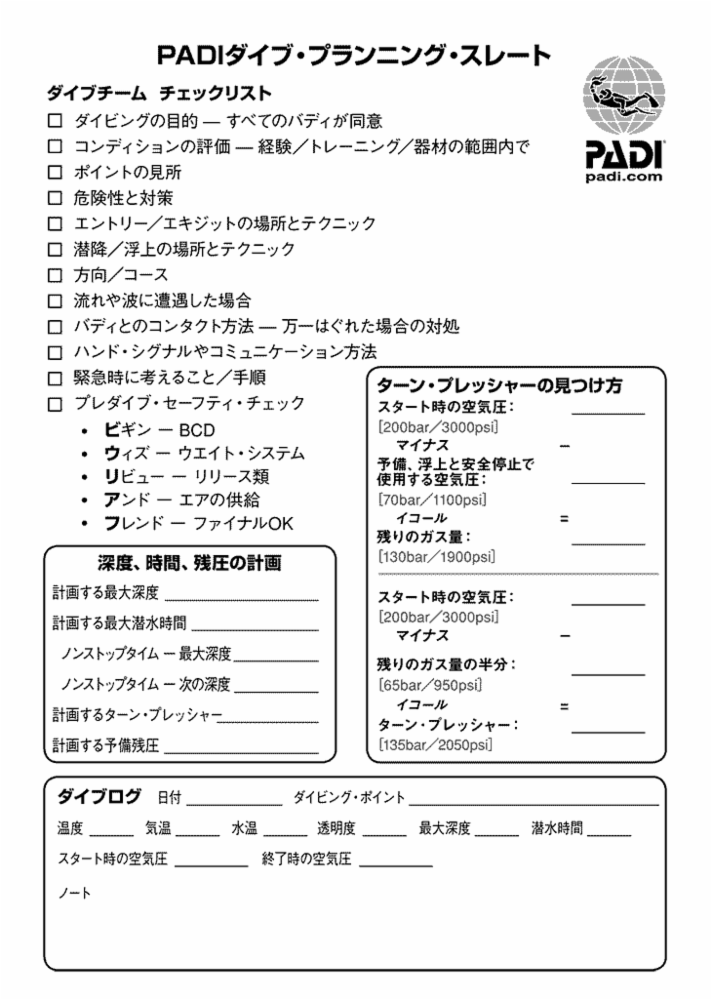

# Open Water Diver 認定

## PADIとOWD

PADI（Professional Association of Diving Instructors）は世界最大のダイビング指導団体。
公式HPを通じてeラーニングの提供やライセンスの発行/管理を行っている。

OWD（Open Water Diving）はPADIが規定するスキューバダイビングのエントリー資格

- 講習
- プール実習
- 海洋実習

を経て最大18mまでのダイビングライセンスが認定される。

## 水圧と浮力

ダイビングでは伝統的にbar（バール）という単位を使う。
1barがちょうど1気圧（地上の一般的な大気圧）である。
水中では約10mごとに1barの水圧がかかる。つまり10m潜ったときの圧力は約2barとなる。

**非圧縮流体**

水は非圧縮流体のため、圧力によって密度と体積が変わらない。
人体もほぼ水で構成されているため水圧によって変化を感じることはほぼないが、肺など中が空洞だと圧力の影響で圧縮される。
また、通常1barの空気は10m潜ると圧縮され体積1/2（密度2倍）になる。

**水中では呼吸を止めてはならない**

仮に息を止めて素潜りする場合を考える。このとき10m潜ると水圧の影響を受けて肺が約1/2に圧縮される。
肺の圧縮は呼吸に致命的な影響を与えるため、スクーバ機材（レギュレーター）は水圧の影響込みで空気を供給する。
つまり10m潜った状態（2bar）では供給される空気も2barに圧縮されているのである。
これにより体外からの圧力（2bar）と肺の内部の圧力が同等になり、肺の圧縮が防がれる。

一方で、仮に水深10mで2barの空気を肺に入れた状態で息を止め、水面に浮上したとする。
この時外圧は1barに変化するため肺の中の空気は体積が約2倍に変化する。
この変化により肺を押し広げて、最悪の場合肺が破裂する。
そのため、水中では必ず呼吸を止めず、常に外圧と同じ空気を肺に送り込むように注意する必要がある。

※ちなみに人間は胸を広げてほんの少し肺の気圧を下げることで外気を取り込んでいる。仮にレギュレーターが水深10mで1barの空気を送り込もうとしても、人間の力では外圧に負けて肺を広げる（胸を膨らませる）ことすらできずそもそも吸い込めないらしい。過去にはロングシュノーケルに失敗する人がいたらしい（笑）

※レギュレーターは空気圧を調整するが、もちろん圧力の高い空気は人体に悪影響を及ぼす。そのためボンベ内の空気は通常酸素比率が少なめに設定されている。アドバンス資格ではガス構成なども学習対象になる。

## スクイズ

潜水時に外圧と内圧の差で生じる不快感をスクイズという。

- 耳：耳内の空気の圧縮によるスクイズ（鼓膜の圧迫）
- マスク、鼻腔：マスク内の空気の圧縮によるスクイズ（マスクの密着）

解消のためにはレギュレーターから送られた空気を、肺から各箇所に送り込めばよい。
この行為を圧平衡と呼ぶ。
圧平衡が上手くできないと鼓膜の破れなどが発生するため、スクイズが発生する前に1mおきに耳抜きをしよう。

また浮上中は減圧によるスクイズの可能性がある

- 呼吸は止めずゆっくり浮上する
- 耳の中の空気がうまく抜けてない場合は一時停止 or 再潜水して空気が抜けるのを待つ
 
など対応が必要

※圧平衡が上手くいかない場合はハンドサイン（後述）でバディに伝えること
※耳栓は制御不能な空間を作るためしない

## スキューバ機材
- マスク
  - スキューバ専用のマスクがある（マスクオフのため鼻まで覆う）
  - フィット性のチェックには、鼻から少し息を吸い込み顔に密着するかどうかを確かめる
  - オプション
    - 曇り止めや ガラスクリーナーを併用すると良い
    - 近視の人はコンタクトをつけるか、度付きのマスクを利用する
- シュノーケル
  - スキューバ中に水面で呼吸するとき用にスキューバでも標準機材となっている
  - 水面ではシリンダーの空気の節約のためシュノーケルで呼吸する
- フィン
  - フルフィット（裸足で使う）かストラップタイプ（靴をつけたままストラップで止める）がある
  - フルフィットの場合は靴下もあるので靴擦れ対策に使う
- スキューバキット
  - BCD（浮力調節具）、レギュレーター、シリンダー、ウェイトシステムで構成される水中生命維持の中核キット
  - BCD：スクーバキットをまとめるベストタイプの道具で、浮力調整にも使える
  - レギュレーター：シリンダーから送られる空気圧を自動調整する器具
  - シリンダー：高圧空気を入れる容器、最近は背中ではなく脇に2本マウントするタイプもある
  - ウエイトシステム：鉛のウエイトを入れてプラス浮力を相殺する。緊急時に脱着できる仕組みを備えている

## プール（限定水域）ダイブ1 スキルチェックリスト

- [ ] ブリーフィング – シグナルの説明/復習
- [ ] 器材のセッティング、装着、調整、プレダイブ・チェック（インストラクター）
- [ ] 水面でBCDに空気を出し入れする、パワー・インフレーター
- [ ] 水中で呼吸する
- [ ] レギュレーター・クリア（2つの方法）
- [ ] レギュレーター・リカバリー
- [ ] 下半分だけ水が入れたマスクをクリアする
- [ ] 残圧計の使い方
- [ ] 水面移動
- [ ] 潜降と圧平衡
- [ ] 水中でハンドシグナル
- [ ] 水中移動
- [ ] 予備の空気源の使い方（静止状態）
- [ ] スキルの練習と遊びのフリータイム
- [ ] 浮上して水面に出る
- [ ] エマージェンシー・ウエイト・ドロップ（ダイブ・フレキシブル）
- [ ] 水面でBCDにオーラルで空気を入れる
- [ ] エキジット

## バディとのダイブプランニング

## 実技演習までのTODO
- [ ] 機材解説（特にレギュレーター回り）のYouTube動画を見る（実際に見た方が早い） 
- [ ] ハンドサインを覚えていく
- [ ] 