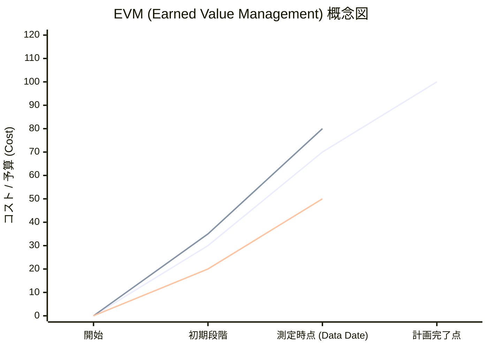

# PMBOK入門

PMBOK第6版をベースとした学習ノート

## PMBOKとは

**PMBOK：Project Management Body of Knowledge**

プロジェクトをマネジメントするための手法を統括的にまとめたマニュアルである。
PMI：Project Management Instituteによって規定されている。
ここでプロジェクトとは「独自のプロダクトやサービスを創造するために実施される有期的な業務」である。
プロジェクトではない業務のうち日常業務や保守など定型作業を行う業務を提携業務と言い、PMBOKによる手法の管轄外となる（部分的な手法の参照はもちろん可能）。

総じてPMBOKはとは、過去の現場のノウハウに基づいてプロジェクトの目的にどうにかして着地（QCDの達成）するために集めてナレッジストア、である。

## PMIタレント・トライアングル

PMBOK第6版で定義されている、PMに求められる3つの主要スキル

1. プロジェクトマネジメントに関するスキル、知識
2. リーダーシップ
3. ビジネス成果をもたらす専門知識

第6版では「戦略的及びビジネスのマネジメント」も求められるようになった。

## プロセス群

プロジェクトのプロセスは下記の5つで構成されるとする。

- 立ち上げ
- 計画
- 実行
- 監視・コントロール
- 終結

この各段階において、後述の10の知識群に関するマネジメントを行う必要があるとPMBOKは言っている。

## 10の知識群

各プロセスにおいて10の知識群（下表）に関するマネジメントを行う。
PMBOK第6版ではこのプロセス群×知識群における具体的手法の紹介が主題である。
各プロジェクトには独自性があるため、これらの手法をテーラリングして引用しつつプロジェクトの着地を目指すと良い。

| 知識エリア \ プロセス群 | 立ち上げ | 計画 | 実行 | 監視・コントロール | 終結 |
| :--- | :--- | :--- | :--- | :--- | :--- |
| |プロジェクト開始の宣言|方向性の策定|計画の実施|計画と実態に差異がないか見張り|プロジェク完了の宣言|
| **統合マネジメント** | プロジェクト憲章の作成により開始を宣言 | プロジェクトマネジメント計画書の作成 | プロジェクト作業の指揮・マネジメント プロジェクト知識のマネジメント | プロジェクト作業の監視・コントロール 統合変更管理の実施 | プロジェクトやフェーズの集結 |
| **スコープマネジメント** | |やる範囲を決めて、WBSを作成する| | 作業範囲が正しいか、逸脱していないかを見張る | |
| **スケジュールマネジメント** | | WBSの内容をだれがいつまでに対応するか決める | | スケジュールの遅延がないかを見張る | |
| **コストマネジメント** | | 必要な金額がいくらで、どう使うか決める | | コストの過不足を見張る | |
| **品質マネジメント** | | どんな品質をどう保証するか決める | 品質保証のための働きかけを行る | 品質が保証できているかを見張る | |
| **リソースマネジメント** | | 必要なリソース（人、モノ、作業環境など）を決める | 教育などを通してリソースを最大限活用できるよう働きかける | リソースが活用できているか見張る | |
| **コミュニケーションマネジメント** | | どのように情報を伝達するか決める | 情報伝達がスムーズに回るよう働きかける | 情報が正しく伝わっているかを見張る | |
| **リスクマネジメント** | | どのようなリスクがある、発生時どうするか決める | リスク発生時に適切に対処するよう働きかける | リスクが発生していないか、発生した場合どう対処されているかを見張る | |
| **調達マネジメント** | | 誰を、何を、いつ準備するのかを決める | 必要なものや人が揃うように働きかける | 必要なものや人が適切に調達されているかを見張る | 調達の終結 |
| **ステークホルダーマネジメント** | 誰と一緒に進めていくのかを洗い出す | ステークホルダーごとの目的を理解し、一致団結するように仕向ける | ステークホルダーのニーズや期待に応えるよう働きかける | ステークホルダーとの関係が良好か見張る | |

### プロジェクト統合マネジメント

**プロジェクト憲章とプロジェクトマネジメント計画書の作成**

プロジェクト憲章とはプロジェクトの目的を記載して開始を宣言しPMに権限を与えるためのドキュメント。
これをもって正式にPMを任命し、マネジメント計画書の作成に取り掛かる（PMとしてのロールはここから開始する）。
プロジェクトマネジメント計画書には10の知識群における実行・監視・コントロール・終結などの方法を記述する。

※全てのプロジェクトで知識ごとにドキュメントを分ける必要はない。要不要を判断して適宜テーラリングしドキュメントをまとめるなど工夫が必要（小規模案件やアジャイル開発でこれらを律義にやると無駄になる）

**プロジェクト憲章の作成**

プロジェクト憲章はイニシエーター（発起人）が記載する、PMを正式に任用するためのドキュメント。
以下のような内容を記載する。

- プロジェクトの目的
- 測定可能な目標と関連する成功基準
- ハイレベルの要求事項
- ハイレベルのプロジェクト記述、境界、及び主要成果物
- プロジェクト全体のリスク
- 要約マイルストーン・スケジュール
- 事前承認された財源
- 主要ステークホルダー・リスト
- プロジェクト承認要求事項（プロジェクトの成否を判断する人など）
- プロジェクト終了基準
- 任命されたPMとその責任と権限のレベル
- プロジェクト憲章を認可するスポンサーなど

**プロジェクトマネジメント計画書**

各種計画書には以下のようなものがある
- 変更管理計画書
- コミュニケーション・マネジメント計画書
- コスト・マネジメント計画書
- イテレーション計画書：アジャイル開発用のドキュメント
- 調達マネジメント計画書
- 品質マネジメント計画書
- リリース計画書
- 要求事項マネジメント計画書
- 資源マネジメント計画書
- リスク・マネジメント計画書
- スコープ・マネジメント計画書
- スケジュール・マネジメント計画書
- ステークホルダー・エンゲージメント計画書
- テスト計画書

※プロジェクトが進むにつれて状況は変化するにつれて曖昧な部分が減り選択肢も減っていく。最初から完璧を求めず「段階的詳細化」することもある

**BOSCARフレームワーク**

ステークホルダー間でどのようなことを共通認識しないといけないか？を整理するためのフレームワーク

- Background：プロジェクト実施の背景
- Objective：プロジェクト実施の理由、目的
- Scope：プロジェクトにおける作業の対象範囲と範囲外
- Constraint：変更不可能な制約
- Assumption：ステークホルダーで設定する仮設
- Report：プロジェクトとしての成果物やゴールの姿

例えば...

既存システムのうち人事マスタ管理がエクセルなので自動化したい（背景）

業務効率化してその過程で人事周りのデータ分析もしたい（目的）

人事パッケージは導入するが、就業は既存のシステムを活用（作業範囲）

社内規定でオンプレ＆プライベートネットワークしか使えない（制約）

ランタイムサーバーは既存のサーバーが用いれる（仮説）

成果物は人事パッケージソフトと仕様ドキュメント（成果物）

のようなイメージ。

**全てPMがやらないといけない？**

プロジェクトマネジメント計画書はPMが一人で作成するわけではなく、PMファシリのもと周囲の協力を得てメンバー全員の合意の下で作成されるべきドキュメントである。
社内に過去の計画書や標準があるはずなので、探してみよう。
また、実際の現場ではPMがプレイヤーを兼ねることもある。プレイングマネジャーにPMBOKの内容を全てやらせるのは非現実的なので適宜テーラリングや権限の委譲を行うこと。

**変更管理**

プロジェクトが予定通り進むことはほぼない。
あらゆる原因でプロジェクトに対する変更が要求される。

- 顧客からの追加要求
- 不具合の発覚やリスクの顕在化
- 病気や災害による影響
- 技術革新

PMは変更を吸い上げ、影響範囲を特定し、適切に対応することが求められる。
もちろん、変更が発生した際には各種マネジメント計画書も影響を受けるためステークホルダーの合意のもと更新する必要がある。
変更の影響を正しく見極めることで、そもそも変更を行うか含めて議論を行おう。

**プロジェクトの終結**

プロジェクト完了後は必ず振り返りを行おう。
ノウハウを貯めることで今後のプロジェクトにおいて活用し、次のプロジェクトの成功確率を高めることができる。
振り返り観点としては

- プロジェクト目標は達成できたか？
- スコープは全て完了したか？
- 要求への対応は完了したか？
- 遅延や前倒しはなかったか？(スケジュール通りか？)
- 予算内で対応できたか？
- 体制は適切だったか？
- コミュニケーションは適切に取れていたか？
- リスクへの対応は適切だったか？
- 外部調達は当初の計画通りだったか？
- ステークホルダーは満足しているか？

総じてプロジェクトマネジメント計画書の内容は達成されたかを振り返る。
可能であれば、関係するステークホルダー(顧客含む)を巻き込んで振り返りを行う。

### プロジェクトスコープマネジメント

**WBSの作成**

プロジェクトの目的に沿って作業範囲(スコープ)を策定する。
作業範囲を漏れなくリスト化したものをWBSという。
ここで作業の細かさはプロジェクト依存するが、大体3段階くらいで書くのがよい。

WBSには下記の2パターンあるので、プロジェクトによって適切に選択する。

- 成果物方式
- プロセス方式

※WBSとガントチャートは明確に分けるようにすること。スケジュールまで手を出すとWBS作成が遅延するため。

**その作業はなんのため？**

WBS作成で重要なことは、都度「なぜやるのか」を考えて明記すること。
無駄な作業や本来の目的との不整合を防ぐため、なぜ(Why)、何を(What)するのかを見極め手法(How)が先走らないようにする。
その都度、プロジェクト憲章記載の目的と照らし合わせて作業のステークホルダー全体での合意を目指す。

※プロジェクトの制約を見極め、実施することだけでなく実施しないことも明記すること。これがスコープを決めるということである。

### プロジェクトスケジュールマネジメント

**スケジュールを図示する**

WBSをインプットにスケジュールを図示する。
主にはガントチャートやバーンダウンチャートによりスケジュールを可視化する。
また、クリティカルパスを決定し重点的に見張ることも重要である。

**バッファを取り入れる**

不確実なリスクに備え、スケジュールにはバッファを取り込む。
この際に作業ごとにバッファがあると、バッファを含めた期限まで作業を続けてしまうというのが開発者の特性である。
そこでCCPM：クリティカルチェーンマネジメントという管理手法がある。
これはバッファをタスクごとではなくプロジェクト全体にまとめて割り振ることで、個別タスクが期限通り進むよう働きかける考え方である。

ただし、もともと期限の短いプロジェクトなどてまはCCPMも効果が薄くなる。
期限超過を許容し、協力してもらうための関係づくりもマネジメントの重要な観点である。

**遅延が発生したら？**

PMBOKではスケジュール圧縮方法として下記の2つを紹介している。

- クラッシング：作業員を追加投入する
- ファスト・トラッキング：作業を並列に進める

クラッシングには教育コストがかかる可能性、ファスト・トラッキングでは作業の依存関係を整理する必要があることを留意して適宜取り入れる必要がある。

※ちなみにリスケは本来しない前提

### プロジェクトコストマネジメント

**予算上限はプロジェクト最大の制約**

基本的に予算はプロジェクト企画前のビジネス企画の段階である程度決まっている(会計年度などの関係や他部署との関係で早々に決まっていることが多い)。
ここで決まった金額がプロジェクトの上限予算であり、よほどのことがない限り追加予算の要求は難しい。
そのため、決まった予算でプロジェクトを完遂することが重要。
自社だけでなく顧客予算も管理しておかないと、超過した場合に責任問題になりかねない。

**予算見積もりの方法**

プロジェクトコストは、ギリギリになりすぎずかつ余裕を持たせすぎずのちょうどいいラインを見極める必要がある。
見積もりの手法には下記のようなものがある。

- 類推見積もり：過去の見積もりを参照して見積もり
- パラメトリック見積もり：
- 三点見積もり：

### プロジェクト品質マネジメント

**品質の尺度を定義する**

品質には機能の充足度や性能、使い勝手などの観点がある。
また品質が良いとはどういう状態かを策定する必要があり、これを「品質指標」という。具体的には

- 社員ごとの給与計算機能がある(機能の充足度の尺度)
- 画面をタッチしたときのレスポンスが1秒以下(性能の尺度)
- PCだけでなくスマホでも操作できる(使い勝手の尺度)

など。できる限り具体的かつ計測可能に定義することが重要。

**3つの品質**

品質には主に3つの品質がある。

1. 使用品質：顧客が実際に利用したときの品質。プロジェクト成果物の納品後にしか測定できない。
2. 設計品質：使用品質担保のため、設計段階で設計書に求める品質。レビューで測定。
3. 製造品質：使用品質担保のため、成果物が設計書に従い適切に製造されているかの品質。レビューやテストで測定。

**適正品質と過剰品質**

プロジェクトの目標に対して沿ってステークホルダー間で合意した品質を適正品質という。
一方で、プロジェクトの目標達成に不要(もしくは不適切)な品質を過剰品質という。

たとえば普通自動車の開発において

- 500km/hが出る…過剰品質
- 一般道で安全に曲がれる…適正品質

といった具合である。プロジェクトの目標に沿って適正品質を見極めステークホルダーと合意することが必要である。

**アジャイル開発**

現実問題、不確実性の高い部分は必ず存在する。
不確実性の高い要求を確実なものに変えていく手法を「アジャイル」という。

### プロジェクトリソースマネジメント

**調達した人の責任と役割を決める**

PMは調達したリソース、特に人のスキルを洗い出してスキル過不足を把握する必要がある。
スキルマップを作製することが推奨される。

スキル把握の上で、各リソースの責任の所在と責任範囲を明確化することで誰がどこを担当するのか明確にする。

**RACIチャート**

リソースの責任範囲を整理する方法の一つ。

- Respoinsible：作業の実行責任者
- Accountable：作業の説明責任者。または承認者。
- Consulted：協業者。または相談者。
- Informed：作業状況の報告先

WBSにRACIの各項目を入れておけば、責任の所在と担当が明確になる。

### プロジェクトコミュニケーションマネジメント

**コミュニケーションの種類**

PMの役割の一つにプロジェクト関係者全員の意思統一が挙げられる。
また情報が漏れなく必要なステークホルダーに伝わる必要がある。
情報の伝達方法は以下のように分別される。

- 双方向コミュニケーション：リアルタイムで情報を交わすコミュニケーション。会議や電話、インスタントメッセージなど。
- プッシュ型コミュニケーション：受信者に向けて配布するコミュニケーション。FAXやメール、ブログやプレスリリースなど。
- プル型コミュニケーション：受信者側の意思で情報にアクセスするコミュニケーション。ノウハウ共有データベースやeラーニングな、ウェブ・ポータルなど

PMはこれらの手段からプロジェクト特性やステークホルダーの数、関係性などを考慮してどの手段で情報伝達を行うのかを選択し計画する。

**一人でもそれを知らないということはあってはならない**

プロジェクトにおいて一人でもそれを知らないということはあってはならない。必ずステークホルダーを巻き込み、また書面で記録を残すことが重要。
また伝えただけでなく「正しく相手が理解したか」を気にかける必要もある。

### プロジェクトリスクマネジメント

**RBSを作ろう**

スコープマネジメントでWBSを作成したように、リスクマネジメントでもRBSを作成しリスクの抜け漏れがないようにする。

**定例の実施**

各プロジェクトで定例を行っていると思うが、定例は何のために行うか？を明確にする必要がある。
定例の目的は、リスクの顕在化をPMが認識すること、であるとする。
メンバーからのリスク報告を受け取り、適切に対応されているかを監視する。

コラム：虫歯の定期検診に例える
定例は虫歯の定期検診のようなもの。定期的に虫歯を見つけ、削ったり穴埋めしたりする。
虫歯は本人は気が付かないことも多い(全体視野でリスク管理するPMの視点が必要になる)。
PMはメンバーが「定期検診」を受けるように働きかける必要がある。
発見が遅れると、歯を抜く(プロジェクトを中止する)必要があることも…

**対処と対策**

リスクが顕在化をすると、正常化するための対処を行う。
対処とは別に、根本原因を見極め今後発生しないようにすることを対策という。
根本原因を取り除くことで今後リスクが顕在化しないようにすることもマネジメントにおいて重要である。
また、同じようなリスクを抱えている箇所が無いかを確認することを横展開という。
横展開を行い「同じ不具合は起きない」と断言できるようにすることで、リスク発生確率を下げることが重要である。

※リスク発生時の横展開にはもちろんコストや時間がかかる。あらかじめスケジュールやコストに横展開のためのバッファを確保することが重要になる。

### プロジェクト調達マネジメント

**外部からの調達**

プロジェクトの各段階で、外部から人手やモノの調達が必要になる(たとえば検証、本番環境の用意やBPの調達、オフショアによる開発自体の外注など)。
調達する際は目標、要求、成果物など具体的には定義して関係者間で認識齟齬がないよう注意する必要がある。

たとえばオフショア開発を外注した際に認識齟齬があると、追加コストやスケジュール遅延など影響が出る可能性がある。

### プロジェクトステークホルダーマネジメント

**プロジェクトは誰のために、誰がやるのか？**

ステークホルダーをもれなく一覧化し、各人がなにに関心を持っておりどのような影響があるのかを整理する。
各ステークホルダーの関心事を把握し、監視することで意見の一致を働きかける。

## PMBOK第7版の変更点

**第7版における思想**

第7版ではより原理的な観点でプロジェクトマネジメントを記載している。すなわち個別のプロセスではなく、
「プロジェクトの成果物によってもたらされるビジネスの生家や価値を最大化して届ける」という原理原則に着目している。

**VUCA時代**

現代は先が見えないVUCA時代と言われている。VUCAとは

- Volatility：変動
- Uncertainty：不確実性
- Complexity：複雑性
- Ambiguity：曖昧性

の頭文字。とにかく変化が激しく不確実で、複雑かつ曖昧な状態であるという。
このような時代にプロジェクトにもめられることは成果物がもたらす本質的な価値や変化は何か？ということである。
本質を見落としたままプロジェクトを進めると、これまで以上にずれたものが出来上がる可能性が高くなっているのである。

第7版ではこのような時代に型にはまった手順ではなく、どのような原理原則で勧めるのか、効率的なプロジェクトマネジメントとはなにかに焦点を当てている。

## いくつかの追加情報と補足

### デザイン思考

不確実性の高い状態で柔軟に価値を提供するためのフレームワーク

- ステージ1：調査。現状の状況や人々の行動を観察/体験
- ステージ2：分析。問題の本質を考える
- ステージ3：統合。課題の再定義と解決策の仮設検討を行う
- ステージ4：実現。プロトタイピングによる試行錯誤を繰り返す

### EVM：アーンドバリューマネジメント

スコープ、スケジュール、コストの進捗と効率を計測し管理するための手法。
EVMでは、ある測定時点（データ・デイト）において以下の3つの指標を比較する。

1. PV（Planned Value：計画価値）: 予定されていた作業の予算
2. EV（Earned Value：出来高）: 実際に完了した作業の予算価値
3. AC（Actual Cost：実コスト）: 実際に投入したコスト

判断の基準は

- 判断の基準コスト管理: $EV - AC > 0$（予算内で順調）/ $< 0$（予算オーバー）
- 進捗管理： $EV - PV > 0$（スケジュール前倒し）/ $< 0$（遅延）

以下はプロジェクトの中盤（データ・デイト）で「進捗が遅れており（EV < PV）、かつコストもオーバーしている（AC > EV）」状態を表した標準的なS字曲線グラフ。

### 振り返りの手法

**KPT法**

プロジェクトの進め方を下記見直す。

- Keep：続けたいこと
- Problem：問題だと思うこと
- Try：試したいこと

**YWT法**

プロジェクトを通して学んだことを次に生かすためのフレームワーク。

- Y：やったこと
- W：わかったこと
- T：次にやること

の観点で振り返る。

**その他よくあるQA**

- PMが管理する人数は？
  - 5~8人が限界といわれている。それ以上になる場合はサブチームに分けリーダーに権限を委譲する。
- PMBOKは世界標準？
  - No。だが、デファクトスタンダードとして知られている。
- PMが全責任を負う？
  - No。ステークホルダー同士で責任を適切に分担できることも、ステークホルダーマネジメントにおける重要なこと。
- プロジェクト計画段階で正確なコスト見積もりが難しいときはどうする？
  - 段階的見積もりを取り入れる。たとえばまず設計まで詳細化し、設計完了時に製造~テストまでを詳細に見積もるなど。ステークホルダー間で見積もりの不正確さを共有、合意しておく必要がある。