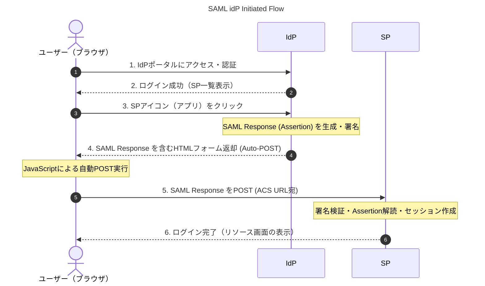
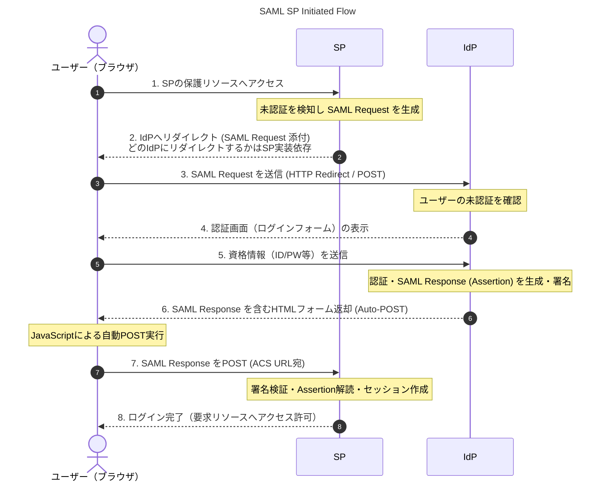
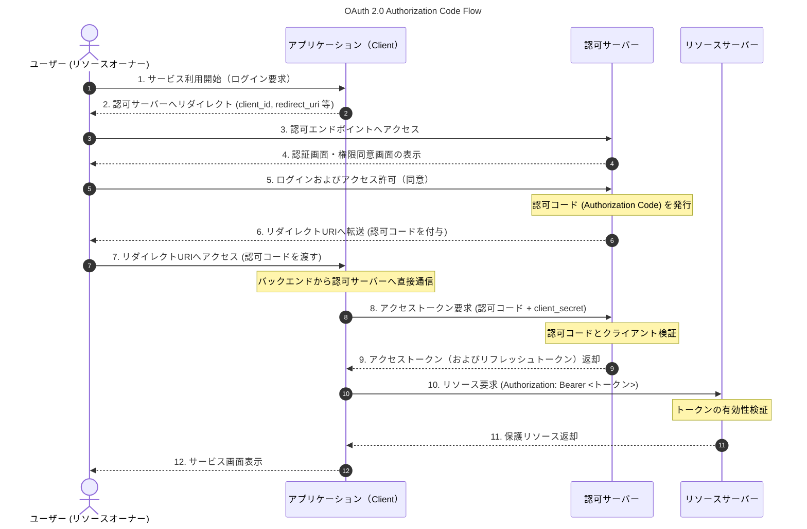
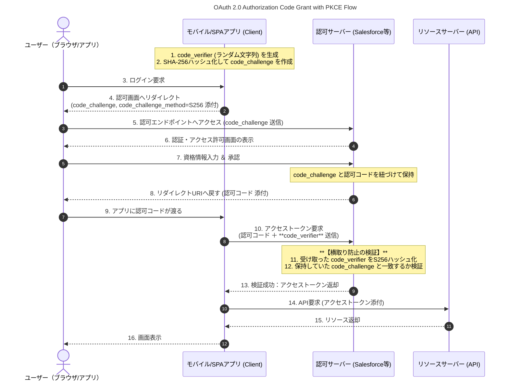

# Salesforce Identity and Access Management (IAM) Architect

## TODO

- [ ] YouTube視聴
- [ ] ハンズオン実施
- [ ] 問題集を解く
- [ ] SAMLアサーションの具体的な内容を確認する
- [ ] SAMLプロトコルにおいてSPとidPに設定する証明書について勉強する
  - [ ] JWTの署名とかもあわせて勉強
- [ ] APEXを簡単に勉強

## YouTubeメモ

- IAMはユーザーの認証とアクセス権の管理を行う仕組み
- 認証
  - 認証されたユーザーに対して何ができるかを権限付与するプロセス
- 認可
  - リソースへのアクセスと操作の権限を付与するプロセス
- SSO
  - アプリ共通でログインできるようにする仕組み
  - 自動プロビジョニングで不適切なアクセスを防止したり、パスワードリセットなどの管理業務の削減のメリットがある
  - ※ ただしidPのアカウント流出リスクはある
- SAML
  - SSOを実現するプロトコル
  - idP
    - ユーザーの認証を行うプロットフォーム（EntraIDやOktaが代表格）
  - SP
    - ユーザーが利用するアプリケーションなどのサービス
  - SAMLアサーション
    - idPが生成する認証情報や属性情報が含まれるXMLデータ
    - これによりSP側でもユーザーが認証される
- SFはidPとしてもSPとしても使える

**SAML認証フロー**

---

---

---

- OAuth 2.0
  - ユーザーの認証情報を共有せずにアプリケーションがリソースへアクセスするための認可プロトコル
  - 認証サーバーと認可サーバーは論理的には分かれているが、実装は基本同じサーバーにあることが多い

**OAuth認可フローの代表例**

---

---

- OAuth Client Credential Flowはユーザー情報を利用せずにclient_id/client_secretで認可するフロー（8以降のみ実施のイメージ）
  - 一時的なトークンをやり取るすることでsecret流出リスクを減らす構造

**OAuth 2.0の主要フロー** ※SFでの呼称が異なるので合わせて記載

# **OAuth 2.0 / 認証の主要フロー（拡張）**

| 一般的な呼称 | SFでの呼称 | 具体的な用途・ユースケース |
| :--- | :--- | :--- |
| **Authorization Code** | **Webサーバーフロー** | サーバーサイド言語で構築された**自社WebアプリやSaaS**から、**ユーザー個人の権限**でSalesforce APIを実行する場合。**Client Secretを安全に保持できる**構成で利用。 |
| **Implicit** | **ユーザーエージェントフロー** | **SPAやモバイルアプリ**など、ブラウザ/デバイス上で直接動作し**Client Secretを隠蔽できない**クライアント向け。（※現在は**PKCE付きWebサーバーフロー**への移行が推奨） |
| **JWT Bearer** | **JWTベアラーフロー** | **バッチ処理やバックエンドシステム**から、**画面操作なしで自動連携**する場合。**証明書（秘密鍵）**で署名し、**管理者による事前承認**のもと指定ユーザーの代理実行が可能。 |
| **Client Credentials** | **クライアントログイン情報フロー** | 個人の権限ではなく、**外部システムの専用サービスアカウント**として直接Salesforce APIを叩くインテグレーション。画面を介さない**純粋なシステム間（M2M）連携**。 |
| **SAML Bearer Assertion** | **SAML 2.0 ベアラーアサーションフロー** | **外部IdP（OktaやAzure ADなど）で既に認証済み**の場合に、その**SAMLアサーションを流用**してSalesforceのアクセストークンを取得するサーバー間・SSO連携。 |
| **Device Flow** | **デバイスフロー** | スマートTVやCLIツール、IoT機器など、**入力やブラウザ機能が制限されたデバイス**からアクセスする場合。**別の端末（スマホやPC）のブラウザで認証**を完了させる。 |
| **Asset Token Flow** | **アセットトークンフロー** | **IoTデバイスやコネクテッド機器**などの「モノ（アセット）」を対象とし、**デバイスごとのコンテキストや識別情報**を紐づけてSalesforceへ安全に接続する場合。 |

※ リフレッシュトークンフローは再認証をせずに、トークンを再発行することでセキュリティリスクを抑えつつ利便性を高める仕組み

- OAuthの設定 ※詳細はハンズオンで勉強
  - SFでは接続アプリケーションで行う
  - ユーザーの権限を設定
  - スコープの設定
  - アクセストークンの取り消し
    - 取り消し用エンドポイントにトークンを送付することで取り消しする
    - 管理者が画面から取り消すことも可能
  - PKCE (ピクシー)
    - モバイルアプリなどで認可コードの横取りを棒する
    - クライアントが認証時と認可時に同じかをcode_challenge, code_velifierを利用して確かめるフロー

**PKCEフロー**

---

---