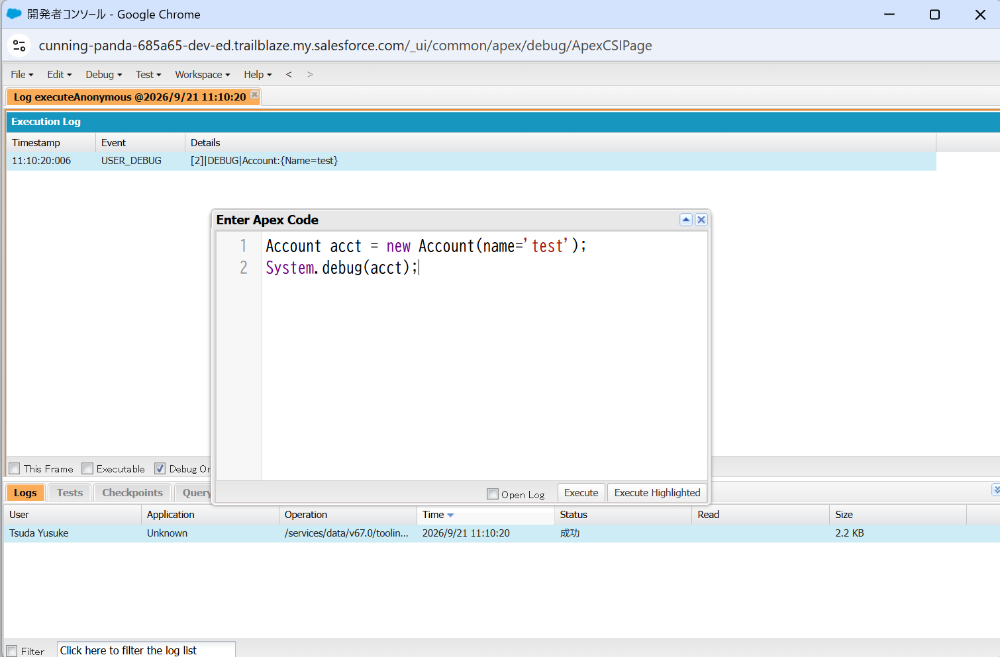
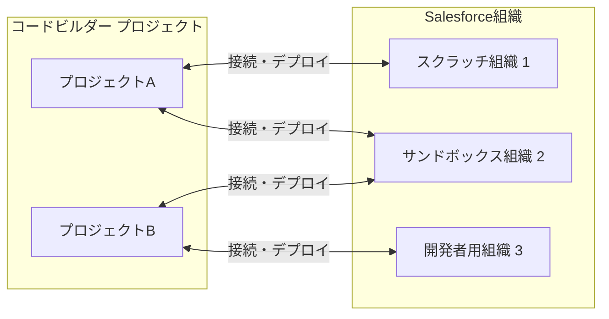
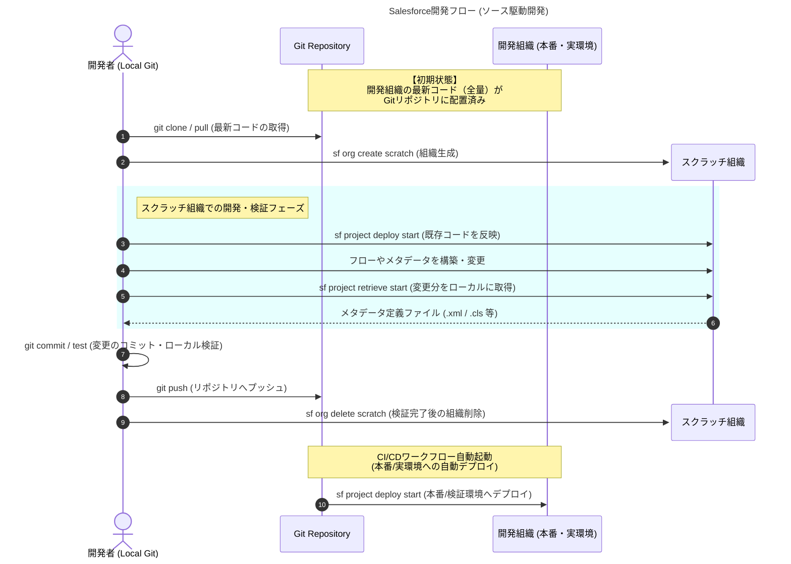

## 開発者コンソールと匿名実行ウィンドウ

Apexクラスの開発及びテストをweb上で実行でできる機能
添付は生成したオブジェクトをdebugログに表示している

UI上からアクセスできない（レコードページに非表示）の項目のupdateなどにも使える

## コードビルダーとSalesforce CLI

Apex及びLWCの開発はVScodeのコードビルダー上でも実行できる。
コードビルダーではプロジェクト（一つの開発ディレクトリ）を作成してコーディングを行う。
通常のコードベースアプリケーションと異なり、プロジェクトとSalesforce組織は多対多でつながる。

### コード管理

上記のように複数組織にプロジェクトをデプロイできるうえに、Web UI上でのカスタムオブジェクトの追加やフローの構築、APEXコードの追加が発生する。
そのため、開発プロジェクトでは変更方法にかかわらずgit repositoryを正とする運用を行うことがベストプラクティスとなっている。
Web UI上で構築した機能をコード化するには、Salesforce CLIまたはプロジェクトにて`SFDX: Retrieve Source from
  Org`を実行することでコードをプロジェクトに反映できる。

### スクラッチ組織

フローの構築などはxmlコードベースではなくフロービルダーで構築する方が圧倒的に早い。
しかし開発環境などCICDの対象となっている環境をWeb UIから変更してしまうと、CICDによるデプロイとコンフリクトしてしまう（実際には気が付かずに上書きされる）。
これを避けるためにスクラッチ組織を利用する。

スクラッチ組織とは有効期限30日間の一時的な組織である。
作成はCLIから`sf org create scratch`を実行するだけで簡単に構築できる。
フロービルダーでのフロー構築などはスクラッチ組織で行い、コードベースで実環境にデプロイするというのがベストプラクティスになっている。

## よくあるCICDフロー

開発環境や本番環境（開発組織）のデプロイ衝突を防ぐため、開発者は使い捨ての「スクラッチ組織」を活用して開発を行い、Gitリポジトリを唯一の「正」として管理。

 
※変更セットはクラシカルなUI上でリリースする手段。アドミン向けの一切コードを書かない標準機能のみの構築以外では基本使わないと思ってよい。